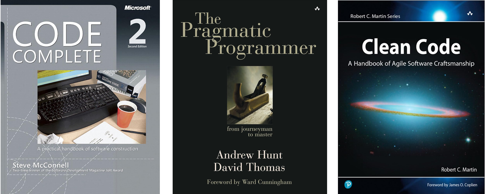

# Presentació

---

## Informació del curs

- **Nom**: Git i GitHub
- **Hores**: 20
- **Professorat**: Miquel Àngel Cabot Nadal

---

## Objectius

- Comprendre els conceptes fonamentals de control de versions amb **Git** (repositori, _commit_, _branch_, _merge_...).
- Aprendre a inicialitzar i gestionar repositoris locals i remots mitjançant **Git** i **GitHub**.
- Saber col·laborar en projectes compartits fent servir **GitHub** (_pull requests_, _issues_, _forks_...).
- Configurar i utilitzar **GitHub Classroom** per a crear, distribuir i avaluar tasques de programació.
- Redactar documentació tècnica utilitzant el llenguatge **Markdown** (_README.md_, instruccions, informes...).

---

## Continguts

- Introducció al control de versions
- **Git**: treball amb repositoris locals
- **GitHub**: repositoris remots i col·laboració
- **GitHub Classroom** per a docents i estudiants
- **Markdown**: documentació clara i estructurada

---

## Temes

1. Introducció a la seguretat del software
2. Git i GitHub. Sistemes de control de versions
3. Llenguatge de marques Markdown
4. Metodologia Scrum
5. Llenguatge C i vulnerabilitats de baix nivell
6. Defensa contra exploits de baix nivell
7. Programació en Rust
8. Desenvolupament segur de software
9. Revisió del codi: testing i anàlisi
10. Proves de penetració (Pentesting)

---

## Avaluació

- **Activitats pràctiques**: 60% de la nota fina
  - Pràctica 1: Temes 1 a 4
  - Pràctica 2: Temes 5 a 6
  - Pràctica 3: Temes 7 a 8
  - Pràctica 4: Temes 9 a 10
- **Exàmens escrits**: 40% de la nota final
  - Exàmen 1r parcial: Temes 1 a 6
  - Exàmen 2n parcial: Temes 7 a 10
- **Exàmen de recuperació**

---

## Programació en Rust

- Algunes pràctiques es faran utilitzant el llenguatge Rust
- **Llibre recomanat**:
  - [The Rust Programming Language](https://doc.rust-lang.org/book/), Steve Klabnik i Carol Nichols

---

## Llibres recomanats per aquesta assignatura

- _Designing Secure Software: A Guide for Developers_, Loren Kohnfelder
- _Writing Secure Code_, David LeBlanc i Michael Howard
- _Penetration Testing: A Hands-On Introduction to Hacking_, Georgia Weidman

---

## Llibres imprescindibles per a programadors

- _Code Complete: A Practical Handbook of Software Construction, Second Edition_, Steve McConnell
- _The Pragmatic Programmer: Your Journey to Mastery_, David Thomas i Andrew Hunt
- _Clean Code: A Handbook of Agile Software Craftsmanship_, Robert C. Martin

---

## 🔗 Enllaços d'interès

- [Informació de l'assignatura](https://estudis.uib.cat/estudis-de-grau/grau/telematica/GTT2-P/22660/index.html)
- [Cronograma](https://academic.uib.es/pds/consultaPublica/look[conpub]InicioPubHora?entradaPublica=true&lock=true&idiomaPais=ca.ES&planDocente=2024&centro=9399&estudio=331&planEstudio=613&curso=4&trimestre=S/2&asignatura22660=22660&&grupo0=4&consultarAsignaturaGrupoPrivada=S)
- [Guia docent](https://academic.uib.es/doa/consultaPublica/look%5bconpub%5dMostrarPubGuiaDocAs?entradaPublica=true&idiomaPais=ca.ES&_anoAcademico=2024&_codAsignatura=22660)
