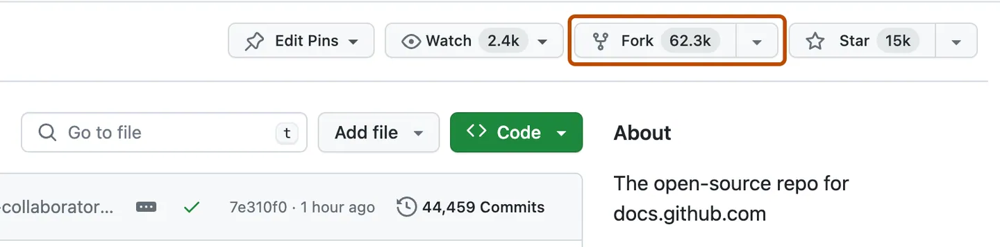
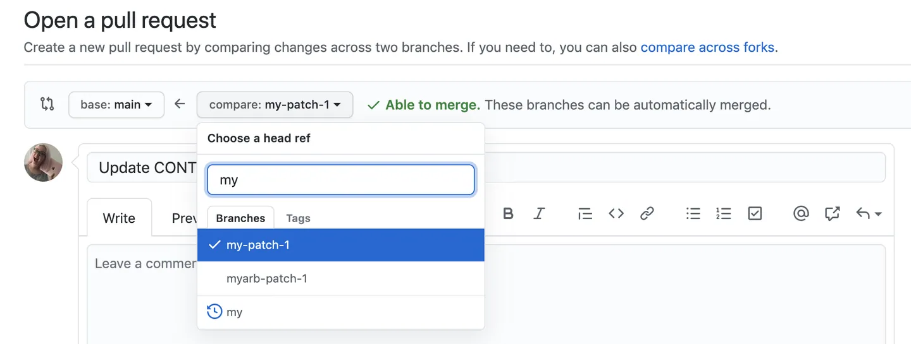
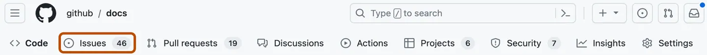
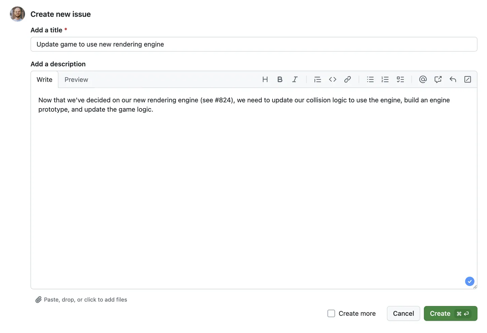
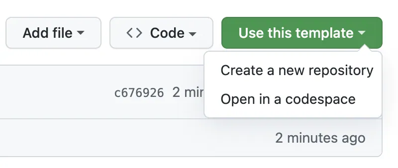

# Col·laboració amb GitHub

---

## Introducció

- GitHub no només serveix per allotjar repositoris, sinó també per **col·laborar en projectes compartits**.
- Les principals eines de col·laboració són:
  - **Forks**: crear una còpia d'un repositori per fer-hi canvis lliurement.
  - **Pull Requests (PRs)**: proposar canvis per integrar-los al repositori original.
  - **Issues**: gestionar problemes, tasques i suggeriments.
- Aquestes funcionalitats faciliten el **treball en equip, el control de qualitat i la transparència**.

---

## Forks

- Un **fork** és una còpia d'un repositori a un altre compte de GitHub.
- Permet:
  - Experimentar amb canvis sense afectar el projecte original.
  - Proposar millores al repositori principal mitjançant **pull requests**.

---v

- Exemple:
  1. Localitza un repositori públic.
  2. Fes clic a **"Fork"**.
  3. El nou repositori apareixerà al teu compte.

---

## Pull Requests (PRs)

- Un **pull request** és una petició per integrar els teus canvis al repositori original.
- Flux de treball típic:
  1. Crear un **fork** i clonar-lo.
  2. Crear una **nova branca** per fer els canvis.
  3. Afegir commits i pujar-los al teu fork.
  4. Obrir un **pull request** des de la branca del fork cap al repositori original.

---v

---v

- Els responsables del projecte poden:
  - Revisar el codi.
  - Demanar modificacions.
  - Acceptar o rebutjar la PR.

---

## Issues

- Les **issues** serveixen per:
  - Informar d'errors (bugs).
  - Proposar noves funcionalitats.
  - Assignar tasques als membres de l'equip.
- Cada issue pot tenir:
  - **Títol i descripció**
  - **Etiquetes** (bug, enhancement, documentation...)
  - **Assignacions** a usuaris
  - **Comentaris i discussions**

---v

- Exemple d'ús:
  - "Bug: el botó de login no funciona a Safari".

---v

---

## Bones pràctiques de col·laboració

- Treballar sempre en **branques** separades (no en `main`/`master`).
- Escriure **commits clars i descriptius**.
- Obrir PRs petites i freqüents en lloc de canvis molt grans.
- Revisar PRs d'altres companys amb comentaris constructius.
- Utilitzar **issues** per documentar totes les tasques.

---

## Exemple de flux de col·laboració

1. **Fork** del repositori original.
2. Crear una **branca** nova al teu fork.
3. Afegir canvis i fer **commits**.
4. Pujar la branca al fork (**git push**).
5. Obrir una **Pull Request**.
6. Revisió i discussió de la PR.
7. **Merge** al repositori original.

---

## Funcionalitats avançades de GitHub

---

## 🌐 GitHub Pages

- Permet **publicar pàgines web directament des d'un repositori**.
- Ideal per documentació, blogs, portafolis i projectes educatius.
- Exemple: un `README.md` es pot convertir en una web estàtica.

---

## ⚙️ GitHub Actions

- Sistema d'**integració i desplegament continu (CI/CD)**.
- Pots definir **workflows** que s'executen automàticament quan hi ha commits o PRs.
- Exemples:
  - Compilar i executar tests.
  - Desplegar aplicacions.
  - Publicar paquets o pàgines web.

---

## 📖 GitHub Wiki

- Espai per crear **documentació col·laborativa** amb Markdown.
- Diferència amb el `README`:
  - El `README` explica el projecte de manera resumida.
  - La **Wiki** pot contenir guies, manuals i informació més extensa.

---

## 📊 GitHub Insights

- Ofereix estadístiques del projecte:
  - Activitat de commits i PRs.
  - Perfils de contribució.
  - Gràfiques de codi, llenguatges, etc.
- Ajuda a **avaluar la salut i la comunitat** d'un projecte.

---

## 💻 GitHub Codespaces

- Entorn de desenvolupament al núvol basat en **Visual Studio Code**.
- Avantatges:
  - No cal instal·lar res al teu ordinador.
  - Pots començar a programar des del navegador.
  - Ideal per a docents i estudiants.

---

## 🤖 GitHub Copilot

- Assistent de programació basat en **IA**.
- Suggeriments de codi en temps real.
- Integrat a **VS Code, JetBrains i Neovim**.
- Pot augmentar la productivitat, però cal revisar sempre el codi suggerit.

---

## 🔗 Enllaços

- [Fork a repository](https://docs.github.com/en/get-started/quickstart/fork-a-repo)
- [Pull requests documentation](https://docs.github.com/en/pull-requests)
- [GitHub Issues documentation](https://docs.github.com/en/issues)
- [GitHub Flow](https://docs.github.com/en/get-started/using-github/github-flow)
- [Quickstart for GitHub Pages](https://docs.github.com/en/pages/quickstart)
- [GitHub Actions documentation](https://docs.github.com/en/actions)
- [Quickstart for GitHub Codespaces](https://docs.github.com/en/codespaces/quickstart)
