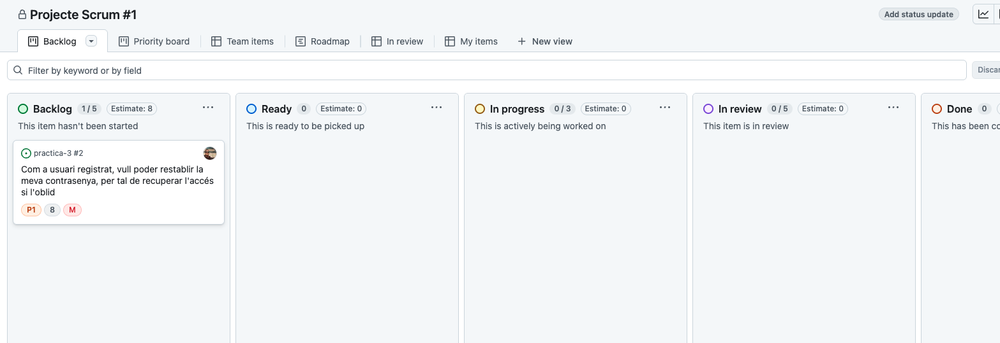
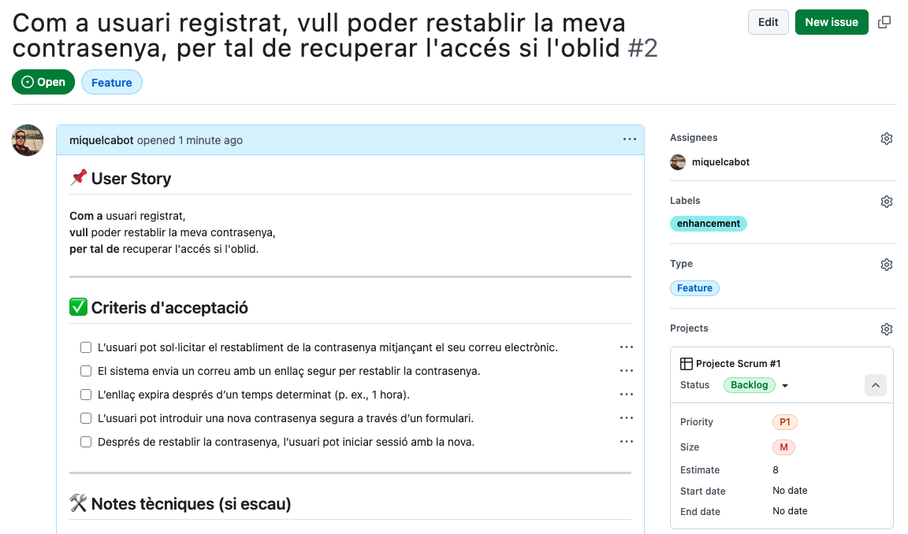

# Gestió de projectes amb GitHub

---

## Gestió de projectes Scrum amb GitHub

- **GitHub Projects** permet gestionar visualment el treball del projecte usant vistes com **Kanban**.
- És útil per organitzar i fer seguiment de **User Stories** i sprints.

---v

### Com crear un projecte a GitHub

1. Accedeix a la pestanya **Projects** del repositori.
2. Fes clic a **New project**.
3. A la finestra **Create project**, selecciona **Featured** --> **Kanban**.
4. Assigna un nom al projecte

---v

### Exemple de projecte a GitHub

---v

### Elements típics de GitHub per Scrum (1)

- **Issues**: cada _User Story_ o tasca es crea com un _issue_ (amb títol, descripció, assignació, etiquetes...).
- **Assignees**: permet assignar membres de l'equip a cada issue.
- **Labels**: permeten classificar issues (p. ex. `bug`, `feature`, `enhancement`, etc.).
- **Projects**: ofereix taulers tipus **Kanban**, on els _issues_ passen per columnes (estats) com:
  - **Backlog**: llista de tasques pendents
  - **Ready**: tasques que s'han de fer en el següent _sprint_
  - **In progress**: tasques que s'estan treballant
  - **In review**: tasques que s'han acabat i estan en revisió
  - **Done**: tasques acabades i revisades

---v

### Elements típics de GitHub per Scrum (i 2)

- **Priority**: es poden assignar prioritats a cada _issue_ (p. ex. `P0`, `P1`, `P2`).
- **Size**: es poden assignar mides a cada _issue_ (p. ex. `XS`, `S`, `M`, `L`, `XL`).
- **Estimate**: es poden assignar estimacions a cada _issue_ (p. ex. `1`, `2`, `3`, `5`, `8`).
- **Milestones**: es poden usar per representar sprints o entregues concretes.
  - [Com crear un milestone](https://docs.github.com/en/issues/using-labels-and-milestones-to-track-work/creating-and-editing-milestones-for-issues-and-pull-requests)

---v

### Exemple de issue (user story)

---v

### ✅ Bones pràctiques

- Escriure cada issue com una **User Story**:
  - _Com a [usuari], vull [acció], per tal de [benefici]_
- Durant la **planificació de l'sprint**:
  - Assignar cada issue a l'sprint actual (**milestone**)
  - Assignar cada issue a un **membre** de l'equip
  - Assignar una **prioritat**, **mida**, **estimació** i **etiquetes** a cada issue
- Actualitzar l'estat dels issues en cada **Daily Scrum**
- Tancar l'issue quan la funcionalitat s'hagi completat i revisat
- Fer servir **Pull Requests** associades a un issue per controlar el codi relacionat

---

## Avantatges de Scrum

- Flexibilitat per al canvi
- Reducció del temps per poder veure el producte, fins i tot sense estar acabat
- Millor qualitat del software
- Millor productivitat
- Millors estimacions de temps
- Reducció de riscos

---

## 🔗 Enllaços

- [Scrum: The Art of Doing Twice the Work in Half the Time (Jeff Sutherland)](https://amzn.eu/d/fBbLyZd)
- [Mastering Professional Scrum (Ockerman Stephanie, Reindl Simon)](https://amzn.eu/d/781dVum)
- [Essential Scrum: A Practical Guide to the Most Popular Agile Process (Kenneth S. Rubin)](https://amzn.eu/d/aFBOZ14)
