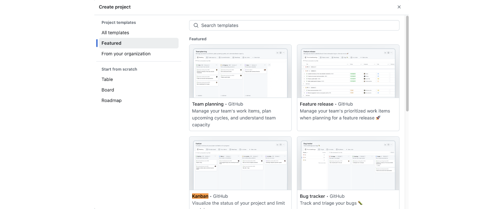

# Gestió de projectes amb GitHub

---

## Gestió de projectes GitHub

- **GitHub Projects** permet gestionar visualment el treball del projecte usant vistes com **Kanban**.
- És útil per organitzar i fer seguiment de tasques, _issues_ i _pull requests_.
- Permet visualitzar l'estat del projecte i identificar bloquejos.
- Facilita la col·laboració entre membres de l'equip.
- Integra amb altres eines de GitHub (_issues_, _pull requests_, etc.).

---

## Com crear un projecte a GitHub

1. Accedeix a la pestanya **Projects** del repositori.
2. Fes clic a **New project**.
3. A la finestra **Create project**, selecciona **Featured** --> **Kanban**.
4. Assigna un nom al projecte

---v

## Exemple de projecte a GitHub

---

## Elements típics de GitHub per projectes

- **Issues**: cada _User Story_ o tasca es crea com un _issue_ (amb títol, descripció, assignació, etiquetes...).
- **Assignees**: permet assignar membres de l'equip a cada issue.
- **Labels**: permeten classificar issues (p. ex. `bug`, `feature`, `enhancement`, etc.).
- **Projects**: ofereix taulers tipus **Kanban**, on els _issues_ passen per columnes (estats) com:
  - **Backlog**: llista de tasques pendents
  - **Ready**: tasques que s'han de fer en el següent _sprint_
  - **In progress**: tasques que s'estan treballant
  - **In review**: tasques que s'han acabat i estan en revisió
  - **Done**: tasques acabades i revisades

---v

- **Priority**: es poden assignar prioritats a cada _issue_ (p. ex. `P0`, `P1`, `P2`).
- **Size**: es poden assignar mides a cada _issue_ (p. ex. `XS`, `S`, `M`, `L`, `XL`).
- **Estimate**: es poden assignar estimacions a cada _issue_ (p. ex. `1`, `2`, `3`, `5`, `8`).
- **Milestones**: es poden usar per representar sprints o entregues concretes.
  - [Com crear un milestone](https://docs.github.com/en/issues/using-labels-and-milestones-to-track-work/creating-and-editing-milestones-for-issues-and-pull-requests)

---

## ✅ Bones pràctiques

- Escriure cada issue com una **User Story**:
  - _Com a [usuari], vull [acció], per tal de [benefici]_
- Durant la **planificació de l'sprint**:
  - Assignar cada issue a l'sprint actual (**milestone**)
  - Assignar cada issue a un **membre** de l'equip
  - Assignar una **prioritat**, **mida**, **estimació** i **etiquetes** a cada issue
- Actualitzar l'estat dels issues en cada **Daily Scrum**
- Tancar l'issue quan la funcionalitat s'hagi completat i revisat
- Fer servir **Pull Requests** associades a un issue per controlar el codi relacionat
  - Per exemple: `Fixes #10` a la descripció de la PR

---

## GitHub Project Management

<!-- markdownlint-disable MD033 -->
<iframe width="560" height="315" src="https://www.youtube.com/embed/oPQgFxHcjAw?si=Vnc_AEurpX6E4dje" title="YouTube video player" frameborder="0" allow="accelerometer; autoplay; clipboard-write; encrypted-media; gyroscope; picture-in-picture; web-share" referrerpolicy="strict-origin-when-cross-origin" allowfullscreen></iframe>
<!-- markdownlint-enable MD033 -->

---

## Using Projects for feature planning

<!-- markdownlint-disable MD033 -->
<iframe width="560" height="315" src="https://www.youtube.com/embed/yFQ-p6wMS_Y?si=3hWVaHk-NmVMwUvb" title="YouTube video player" frameborder="0" allow="accelerometer; autoplay; clipboard-write; encrypted-media; gyroscope; picture-in-picture; web-share" referrerpolicy="strict-origin-when-cross-origin" allowfullscreen></iframe>
<!-- markdownlint-enable MD033 -->
